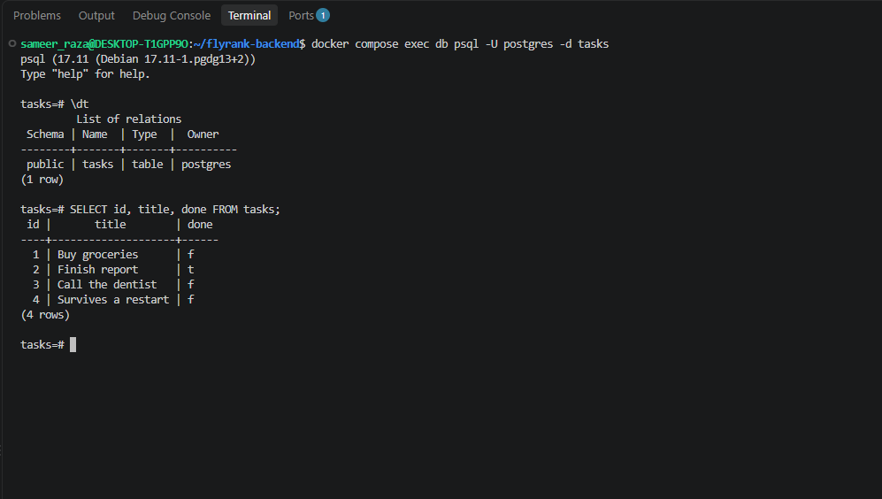

# Task API

A small CRUD API for managing a to-do list. Built for the FlyRank internship
backend track (A1, A2, A3). Tasks are stored in **Postgres, run in
Docker**, so data survives both a server restart and a container restart.

Built with Node.js, Express, and Postgres (via `pg`).

## Run it

The primary way to run the whole stack — API + database — is Docker Compose:

```bash
cp .env.example .env      # then edit POSTGRES_PASSWORD if you want
docker compose up
```

This builds the API image and starts Postgres and the API together. Postgres
comes up first (the API waits on its healthcheck), then the API creates the
`tasks` table and seeds 3 example tasks on first boot, and listens on
http://localhost:3000.

The healthcheck matters: `depends_on` on its own waits for the container
to start, not for Postgres to accept connections. The API exits if it
can't connect on boot, so without the healthcheck it loses that race.

`docker compose down` stops both containers but keeps the data volume;
`docker compose down -v` also deletes the data.

### Without Docker

Requires Node.js 18+ (developed on Node 22) and a Postgres reachable at the
`DATABASE_URL` in `.env`:

```bash
npm install
npm start
```

The endpoint table below is unchanged from the in-memory and SQLite
versions. Only the storage layer was replaced.

## Endpoints

| Method | Path | Description | Success | Errors |
|--------|------|-------------|---------|--------|
| GET | `/` | API info | 200 | |
| GET | `/health` | Health check | 200 | |
| GET | `/tasks` | List all tasks | 200 | |
| GET | `/tasks/:id` | Get one task | 200 | 404 |
| POST | `/tasks` | Create a task | 201 | 400 |
| PUT | `/tasks/:id` | Update a task | 200 | 400, 404 |
| DELETE | `/tasks/:id` | Delete a task | 204 | 404 |

### Task shape

```json
{
  "id": 1,
  "title": "Buy groceries",
  "done": false
}
```

### Validation rules

- `title` is required on create, must be a non-empty string (whitespace-only
  is rejected), and is trimmed before saving.
- On update, `title` and/or `done` may be sent — at least one is required.
  `title` follows the same rule as above; `done` must be a boolean.
- Malformed JSON bodies and unexpected server errors return a JSON error
  message instead of leaking a stack trace.

## Database

Data is stored in Postgres. All SQL lives in `src/db.js` — the route handlers
in `src/index.js` never touch SQL directly.

**Why Postgres:** SQLite was a single file with no server — fine for one
process on one machine. Postgres is the real server every later week assumes:
concurrent writers, connection pooling, a network the API talks to it over.
Running it in Docker means no local install, and the whole stack comes up
with one `docker compose up`.

### Architecture: what actually changed

Swapping SQLite for Postgres touched **`src/db.js` plus its dependency**
(`better-sqlite3` out, `pg` in). `src/index.js` route handlers gained
`async`/`await` — the `pg` client is asynchronous where `better-sqlite3`
was synchronous — but their contract (paths, status codes, JSON shape,
validation) did not change. So "swap the storage engine, touch one file"
holds for the SQL; the routes only changed shape, not behaviour.

### Configuration

The connection string comes from `DATABASE_URL`. `.env` holds the real
values and is git-ignored (`.env` in `.gitignore`); `.env.example` is
committed as a template — copy it to `.env` before running. Compose also
reads `POSTGRES_PASSWORD` from `.env` to provision the Postgres container
and to build the `DATABASE_URL` it passes the API (with host `db`, the
service name on the compose network — not `localhost`).

### Connection pool

`pg` keeps a pool of open connections between requests. If the database
restarts while the API keeps running, the pool still holds sockets to a
server that is gone, and the next query waits on one forever. The pool is
configured with `idleTimeoutMillis` and `connectionTimeoutMillis` so it
drops stale connections and fails fast instead of hanging.

### Persistence

Postgres writes to the `taskdata` Docker volume, declared in
`compose.yaml`. The volume is independent of the container, so data
survives `docker compose down` and a fresh `up`.

The image is pinned to `postgres:17`. Postgres 18 changed the data
directory layout inside the official image, so a volume mounted at
`/var/lib/postgresql/data` breaks against `postgres:latest`.

Postgres has a real `boolean` type, so `done` comes back from the driver
as a JavaScript `true`/`false` already — the `0`/`1` conversion the
SQLite version did in `src/db.js` is gone. The API shape is unchanged.

### Proving persistence

Checked across an app **and** container restart:

1. `docker compose up` — table seeded with 3 tasks.
2. Create a 4th:
   ```bash
   curl -X POST localhost:3000/tasks \
     -H 'content-type: application/json' \
     -d '{"title":"Survives a restart"}'
   ```
3. `docker compose down` — stops and removes both containers. No `-v`, so
   the `taskdata` volume stays.
4. `docker compose up` again — rebuilds and restarts both.
5. `curl localhost:3000/tasks` — the 4th task is still there, and the seed
   step is skipped because the table isn't empty.

`docker compose down -v` deletes the volume; the next `up` seeds from
scratch.

### Example query

In `psql` (`docker compose exec db psql -U postgres -d tasks`):

```sql
\dt
SELECT id, title, done FROM tasks;
```



Row 4 is the task created before a `docker compose down` — it is still
there after the stack came back up.

## Example request

```
$ curl -i http://localhost:3000/tasks/1
HTTP/1.1 200 OK
X-Powered-By: Express
Content-Type: application/json; charset=utf-8
Content-Length: 45
ETag: W/"2d-Gv8HDdZD1sn+UqMseo56OTgQmek"
Date: Wed, 09 Sep 2026 14:50:52 GMT
Connection: keep-alive
Keep-Alive: timeout=5

{"id":1,"title":"Buy groceries","done":false}
```

## Swagger UI

Interactive docs at http://localhost:3000/docs


