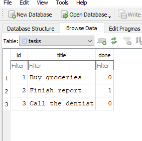
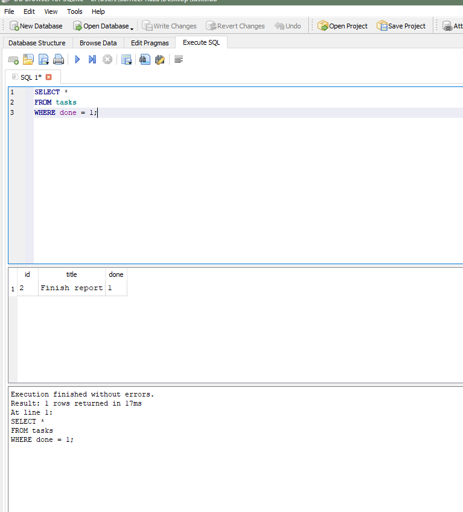
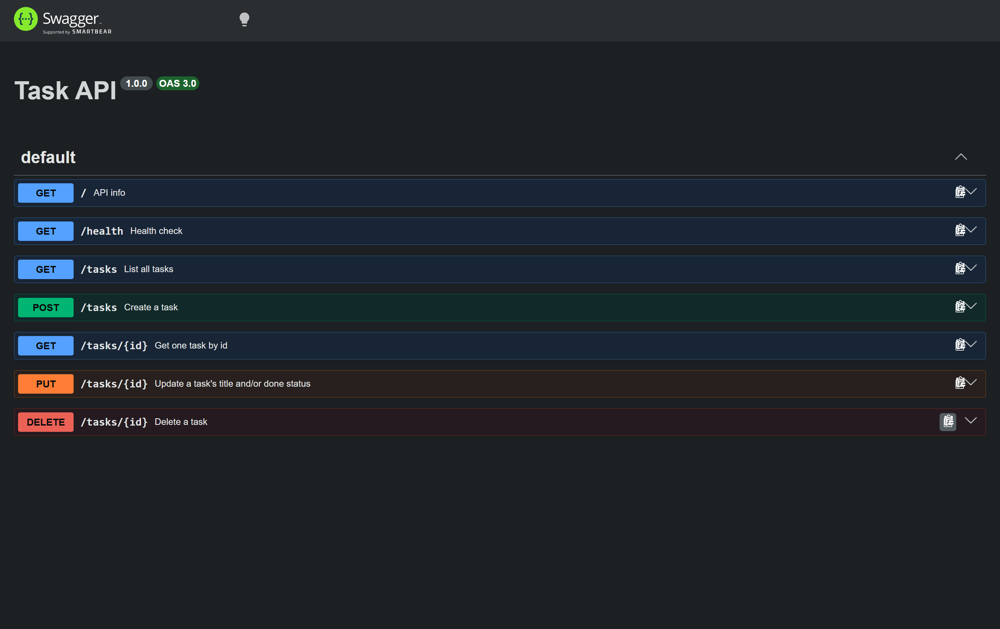

# Task API

A small CRUD API for managing a to-do list. Built for the FlyRank internship
backend track (W2 · A1, W3 · A1). Tasks are stored in a SQLite database, so
data survives server restarts.

Built with Node.js, Express, and SQLite (via `better-sqlite3`).

## Run it

Requires Node.js 18+ (developed on Node 22).

```bash
npm install
npm start
```

The server starts on http://localhost:3000

The endpoint table below is unchanged from the in-memory version. Only
the storage layer was replaced.

## Endpoints

| Method | Path | Description | Success | Errors |
|--------|------|-------------|---------|--------|
| GET | `/` | API info | 200 | |
| GET | `/health` | Health check | 200 | |
| GET | `/tasks` | List all tasks | 200 | |
| GET | `/tasks/:id` | Get one task | 200 | 404 |
| POST | `/tasks` | Create a task | 201 | 400 |
| PUT | `/tasks/:id` | Update a task | 200 | 400, 404 |
| DELETE | `/tasks/:id` | Delete a task | 204 | 404 |

### Task shape

```json
{
  "id": 1,
  "title": "Buy groceries",
  "done": false
}
```

### Validation rules

- `title` is required on create, must be a non-empty string (whitespace-only
  is rejected), and is trimmed before saving.
- On update, `title` and/or `done` may be sent — at least one is required.
  `title` follows the same rule as above; `done` must be a boolean.
- Malformed JSON bodies and unexpected server errors return a JSON error
  message instead of leaking a stack trace.

## Database

Data is stored in SQLite, in a single file at `tasks.db` in the project
root. All SQL lives in `src/db.js` — the route handlers in `src/index.js`
never touch SQL directly, so swapping to another database later only means
changing that one file.

**Why SQLite:** the assignment needs real persistence without the overhead
of running a separate database server. SQLite needs no installation and no
server process — it's just a file, which is exactly the difference this
project is meant to demonstrate: the API works the same whether tasks live
in an array or in a database.

`tasks.db` is listed in `.gitignore` (via the `*.db` pattern) and is not
committed. It's generated data, not source code — each developer (or CI run)
gets a fresh database on first start, seeded automatically with 3 example
tasks by `src/db.js`.

SQLite has no boolean type, so `done` is stored as `0`/`1` and converted
to `true`/`false` in `src/db.js` before it leaves the API. The stored
shape changed; the API shape did not.

### Example query

Opened in DB Browser for SQLite:

```sql
SELECT * FROM tasks WHERE done = 1;
```

| id | title         | done |
|----|---------------|------|
| 2  | Finish report | 1    |





## Example request

```
$ curl -i http://localhost:3000/tasks/1
HTTP/1.1 200 OK
X-Powered-By: Express
Content-Type: application/json; charset=utf-8
Content-Length: 45
ETag: W/"2d-Gv8HDdZD1sn+UqMseo56OTgQmek"
Date: Wed, 09 Sep 2026 05:03:07 GMT
Connection: keep-alive
Keep-Alive: timeout=5

{"id":1,"title":"Buy groceries","done":false}
```

## Swagger UI

Interactive docs at http://localhost:3000/docs


