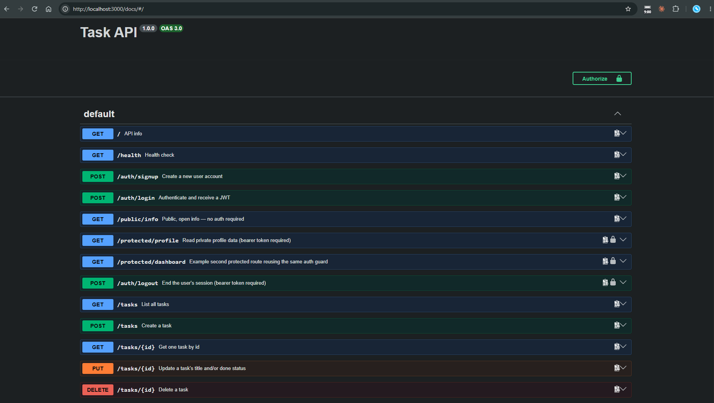
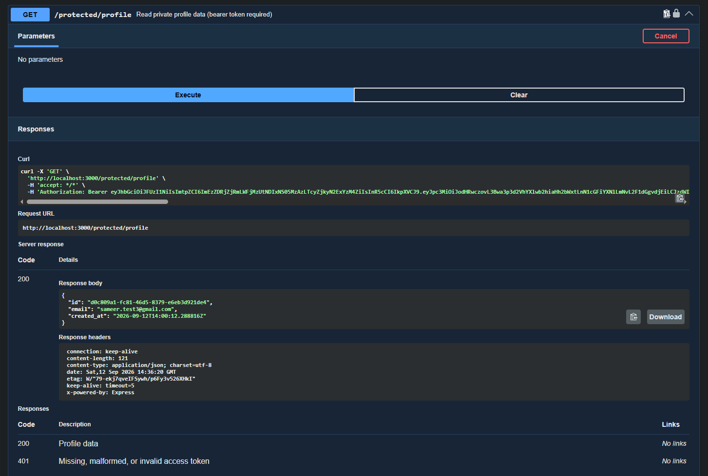

# Task API

A small CRUD API for managing a to-do list. Built for the FlyRank internship
backend track (A1–A4). Tasks are stored in **Postgres, run in Docker**, so
data survives both a server restart and a container restart.

**A4** adds an auth layer on top: **Supabase Auth** handles signup, login,
and logout, and a bearer-token guard protects a small set of `/protected/*`
routes. The task CRUD from A1–A3 is unchanged and still wide open — the
assignment only ever asked for auth on `/protected/*`, not on `/tasks`, so
`GET /tasks` needing no token is intentional, not a leftover hole.

Built with Node.js, Express, Postgres (via `pg`), and Supabase Auth.

## Run it

### Set up Supabase

The auth layer needs a Supabase project — Supabase is the identity
provider here; this API never stores or hashes a password itself.

1. Create a free project at [supabase.com](https://supabase.com).
2. **Project Settings → API** — copy the **Project URL** and the **anon
   key** into `.env` as `SUPABASE_URL` and `SUPABASE_KEY`.
3. **Authentication → Sign In / Providers → Email** — turn **"Confirm
   email" off.**

**Why the anon key, not `service_role`:** the anon key is public and grants
no privileged access by itself — it only lets the client reach the
unauthenticated auth endpoints (`signup`, `login`). Anything beyond that
runs on the caller's own JWT, verified per request via `getUser(token)`.
`service_role` is the opposite: it bypasses every check Supabase does, so
it must never leave a trusted server, let alone sit in a repo's
`.env.example`. This API only ever needs the anon key.

**Why turning off "Confirm email" matters:** this is exactly the
checkpoint the assignment is graded on — a peer clones the repo, drops in
their own `.env`, and the API works in under 5 minutes. With email
confirmation left on, a fresh `POST /auth/signup` still succeeds, but the
`POST /auth/login` that follows fails with "Invalid login credentials" —
not because anything in the code is wrong, but because Supabase is
silently waiting on a confirmation email nobody sent. It's a five-second
dashboard toggle standing between "it works" and an unexplained 401.

### Full stack (Docker)

The primary way to run the whole stack — API + database — is Docker Compose:

```bash
cp .env.example .env      # POSTGRES_PASSWORD, plus SUPABASE_URL/SUPABASE_KEY from above
docker compose up
```

This builds the API image and starts Postgres and the API together. Postgres
comes up first (the API waits on its healthcheck), then the API creates the
`tasks` table and seeds 3 example tasks on first boot, and listens on
http://localhost:3000.

The healthcheck matters: `depends_on` on its own waits for the container
to start, not for Postgres to accept connections. The API exits if it
can't connect on boot, so without the healthcheck it loses that race.

`docker compose down` stops both containers but keeps the data volume;
`docker compose down -v` also deletes the data.

### Development mode (API on the host, Postgres in Docker)

Editing `src/*.js` and re-running `docker compose up` every time is slow.
For active development, run only Postgres in Docker and the API directly
on the host with `npm run dev` (auto-restarts on file changes):

```bash
docker compose up -d --no-deps db
npm run dev
```

**Why `--no-deps`:** plain `docker compose up db` still starts every
service that `db` is a dependency of — which includes `api` — so Compose's
own `api` container comes up too and binds port 3000 right alongside the
`npm run dev` process on the host. Both processes end up serving on 3000
at once, and requests land on whichever one happened to grab the port
first, with no error to say so. This was hit firsthand while developing
this stage: the server "worked," but edits to `src/index.js` weren't
showing up in responses, because the container's stale build — not the
host process being edited — was the one actually answering. `--no-deps`
starts only `db`, so port 3000 belongs to `npm run dev` alone.

### Without Docker entirely

Requires Node.js 18+ (developed on Node 22) and a Postgres reachable at the
`DATABASE_URL` in `.env`:

```bash
npm install
npm start
```

The endpoint table below is unchanged from the in-memory and SQLite
versions. Only the storage layer was replaced.

## Endpoints

| Method | Path | Description | Auth | Success | Errors |
|--------|------|-------------|------|---------|--------|
| GET | `/` | API info | None | 200 | |
| GET | `/health` | Health check | None | 200 | |
| POST | `/auth/signup` | Create a new user account | None | 201 | 400 |
| POST | `/auth/login` | Authenticate, get a JWT | None | 200 | 400, 401 |
| POST | `/auth/logout` | End the user's session | Bearer token | 204 | 401 |
| GET | `/public/info` | Public, open info | None | 200 | |
| GET | `/protected/profile` | Read the caller's own profile | Bearer token | 200 | 401 |
| GET | `/protected/dashboard` | Second protected route (same guard) | Bearer token | 200 | 401 |
| GET | `/tasks` | List all tasks | None | 200 | |
| GET | `/tasks/:id` | Get one task | None | 200 | 404 |
| POST | `/tasks` | Create a task | None | 201 | 400 |
| PUT | `/tasks/:id` | Update a task | None | 200 | 400, 404 |
| DELETE | `/tasks/:id` | Delete a task | None | 204 | 404 |

### Task shape

```json
{
  "id": 1,
  "title": "Buy groceries",
  "done": false
}
```

### Validation rules

- `title` is required on create, must be a non-empty string (whitespace-only
  is rejected), and is trimmed before saving.
- On update, `title` and/or `done` may be sent — at least one is required.
  `title` follows the same rule as above; `done` must be a boolean.
- Malformed JSON bodies and unexpected server errors return a JSON error
  message instead of leaking a stack trace.

## Authentication

Supabase is the identity provider — it stores accounts, hashes passwords,
and signs tokens. This API never touches a password directly and never
hashes anything itself: `/auth/signup` and `/auth/login` just forward
credentials to Supabase and hand back what it returns.

1. `POST /auth/signup` / `POST /auth/login` → Supabase checks or creates
   the account and returns an **access token** (a JWT) and a refresh
   token.
2. The client sends that access token on every request that needs one, as
   `Authorization: Bearer <token>`.
3. The server verifies it with `supabase.auth.getUser(token)` — a real
   network call to Supabase, not just decoding the JWT locally — and
   attaches the result to `req.user` for the route to use.

### Middleware

The verification step lives in exactly one place: `requireAuth` in
`src/authMiddleware.js`. Both protected routes (`GET /protected/profile`
and `GET /protected/dashboard`) use it as-is — neither route contains a
single line of auth logic itself. Adding a new protected route means
dropping `requireAuth` in front of it, nothing else.

**Header parsing nuance:** the guard checks
`authHeader?.startsWith("Bearer ")` — with the trailing space — so
`Authorization: sometoken` (no `Bearer` scheme) is rejected outright
instead of being silently treated as a bare token. And the extracted token
is `.trim()`-ed before the `!token` check, because
`Authorization: Bearer ` (trailing spaces, no real token) slices out a
non-empty whitespace string — without the trim, that string is truthy,
sails past the check, and reaches Supabase as a doomed `getUser()` call
instead of failing fast with a `401`.

### Logout

`src/supabase.js` creates **one Supabase client, shared by the whole
server**, and that client keeps its own session state in memory — even
with `persistSession: false`, which only stops it from writing that
session to disk, not from tracking "the current session" in memory.
`supabase.auth.signInWithPassword()` overwrites that shared session on
every login. That's harmless for the calls this API currently makes —
`getUser(token)` takes the token as an explicit argument and never reads
the shared session — but `supabase.auth.signOut()` does the opposite: it
takes no token argument at all. It only ever signs out whatever session
happens to be sitting in that one shared client object at the moment it's
called. This is only defused, not fixed, as long as every SDK call this
API makes keeps passing its token explicitly — any future call added
against the shared client's implicit session would reopen the same hole.

**The bug this caused:** user A logs in, then user B logs in, overwriting
the shared client's session with B's. A then calls `POST /auth/logout`
with A's own token in the `Authorization` header. The route's guard
correctly verifies A's token and lets the request through — but calling
`supabase.auth.signOut()` with no arguments signed out whatever session
was last stored on the shared client: B's, not A's. The response was still
a clean `204` to A, so nothing *looked* wrong. Confirmed with two logged-in
users side by side: A's logout call, followed by B's very next request
with B's still-supposedly-valid token, came back `401` instead of A's.

**The fix:** stop relying on the SDK's ambient shared session for logout
entirely. `signOutUser(token)` in `src/supabase.js` calls Supabase's
GoTrue `/auth/v1/logout` endpoint directly, with the *exact* token from
the request as the `Authorization` header — never touching the shared
client's session state. `POST /auth/logout` passes it `req.token`, the
same token `requireAuth` already verified moments earlier. Re-running the
same A/B test after the fix: A's logout revokes only A's token, and B
stays logged in.

**Why logout takes effect immediately, unlike a typical stateless JWT
setup:** a JWT is normally validated by checking its signature alone — the
server has no independent way to know it was "logged out" before its
stated expiry, since nothing gets checked against a session table.
Supabase's `getUser(token)` is different: it's a live call to Supabase,
which checks the token against its own session record, not the signature
alone. So the moment `signOutUser()` revokes that session server-side, the
very next `getUser(token)` call from any protected route sees the session
is gone and returns `401` — well before the token's stated one-hour
expiry. The cost is that every protected request is a real round trip to
Supabase rather than a local signature check, which is the trade this API
makes in exchange for logout actually meaning something.

## Notes

- Supabase rejects `@example.com` addresses as an invalid domain —
  `example.com` is an RFC 2606 reserved test domain that no mailbox can
  ever exist on — so manual testing during this build used a real domain
  instead of the `test@example.com` from the assignment's own curl
  examples.
- `POST /auth/signup` returns the full user object Supabase hands back
  (per the assignment's own spec for that stage), but `GET
  /protected/profile` deliberately narrows that down to `id`, `email`,
  and `created_at`. The narrower profile response is the one that matches
  real practice — nothing in a Supabase user object is secret, but a
  client shouldn't be handed metadata it never asked for.
- Every Supabase-side signup rejection (duplicate email, weak password,
  invalid domain, etc.) currently surfaces from `/auth/signup` as a
  flat `400`. That's a simplification: a real rate-limit rejection from
  Supabase is a `429`, not a `400`, and this API doesn't distinguish them
  yet.

## Database

Data is stored in Postgres. All SQL lives in `src/db.js` — the route handlers
in `src/index.js` never touch SQL directly.

**Why Postgres:** SQLite was a single file with no server — fine for one
process on one machine. Postgres is the real server every later week assumes:
concurrent writers, connection pooling, a network the API talks to it over.
Running it in Docker means no local install, and the whole stack comes up
with one `docker compose up`.

### Architecture: what actually changed

Swapping SQLite for Postgres touched **`src/db.js` plus its dependency**
(`better-sqlite3` out, `pg` in). `src/index.js` route handlers gained
`async`/`await` — the `pg` client is asynchronous where `better-sqlite3`
was synchronous — but their contract (paths, status codes, JSON shape,
validation) did not change. So "swap the storage engine, touch one file"
holds for the SQL; the routes only changed shape, not behaviour.

### Configuration

The connection string comes from `DATABASE_URL`. `.env` holds the real
values and is git-ignored (`.env` in `.gitignore`); `.env.example` is
committed as a template — copy it to `.env` before running. Compose also
reads `POSTGRES_PASSWORD` from `.env` to provision the Postgres container
and to build the `DATABASE_URL` it passes the API (with host `db`, the
service name on the compose network — not `localhost`).

### Connection pool

`pg` keeps a pool of open connections between requests. If the database
restarts while the API keeps running, the pool still holds sockets to a
server that is gone, and the next query waits on one forever. The pool is
configured with `idleTimeoutMillis` and `connectionTimeoutMillis` so it
drops stale connections and fails fast instead of hanging.

### Persistence

Postgres writes to the `taskdata` Docker volume, declared in
`compose.yaml`. The volume is independent of the container, so data
survives `docker compose down` and a fresh `up`.

The image is pinned to `postgres:17`. Postgres 18 changed the data
directory layout inside the official image, so a volume mounted at
`/var/lib/postgresql/data` breaks against `postgres:latest`.

Postgres has a real `boolean` type, so `done` comes back from the driver
as a JavaScript `true`/`false` already — the `0`/`1` conversion the
SQLite version did in `src/db.js` is gone. The API shape is unchanged.

### Proving persistence

Checked across an app **and** container restart:

1. `docker compose up` — table seeded with 3 tasks.
2. Create a 4th:
   ```bash
   curl -X POST localhost:3000/tasks \
     -H 'content-type: application/json' \
     -d '{"title":"Survives a restart"}'
   ```
3. `docker compose down` — stops and removes both containers. No `-v`, so
   the `taskdata` volume stays.
4. `docker compose up` again — rebuilds and restarts both.
5. `curl localhost:3000/tasks` — the 4th task is still there, and the seed
   step is skipped because the table isn't empty.

`docker compose down -v` deletes the volume; the next `up` seeds from
scratch.

### Example query

In `psql` (`docker compose exec db psql -U postgres -d tasks`):

```sql
\dt
SELECT id, title, done FROM tasks;
```


Row 4 is the task created before a `docker compose down` — it is still
there after the stack came back up.

## Example request

```
$ curl -i http://localhost:3000/tasks/1
HTTP/1.1 200 OK
X-Powered-By: Express
Content-Type: application/json; charset=utf-8
Content-Length: 45
ETag: W/"2d-Gv8HDdZD1sn+UqMseo56OTgQmek"
Date: Wed, 09 Sep 2026 14:50:52 GMT
Connection: keep-alive
Keep-Alive: timeout=5

{"id":1,"title":"Buy groceries","done":false}
```

## Swagger UI

Interactive docs at http://localhost:3000/docs. The lock icon only shows up
on the three bearer-guarded routes — `GET /protected/profile`,
`GET /protected/dashboard`, and `POST /auth/logout` — everything else,
including all of `/tasks`, has no lock, because it needs no token.

**Authorize dialog:** paste just the raw access token, not
`Bearer <token>` — Swagger already adds the `Bearer ` prefix itself from
the `bearerFormat: JWT` scheme declared in `openapi.json`. Pasting the
full `Bearer <token>` string doubles it up into
`Authorization: Bearer Bearer <token>`, which Supabase then rejects.





<sub>`docs/swagger.png` is the A3 screenshot, from before auth routes
existed — kept for history, not shown here.</sub>
